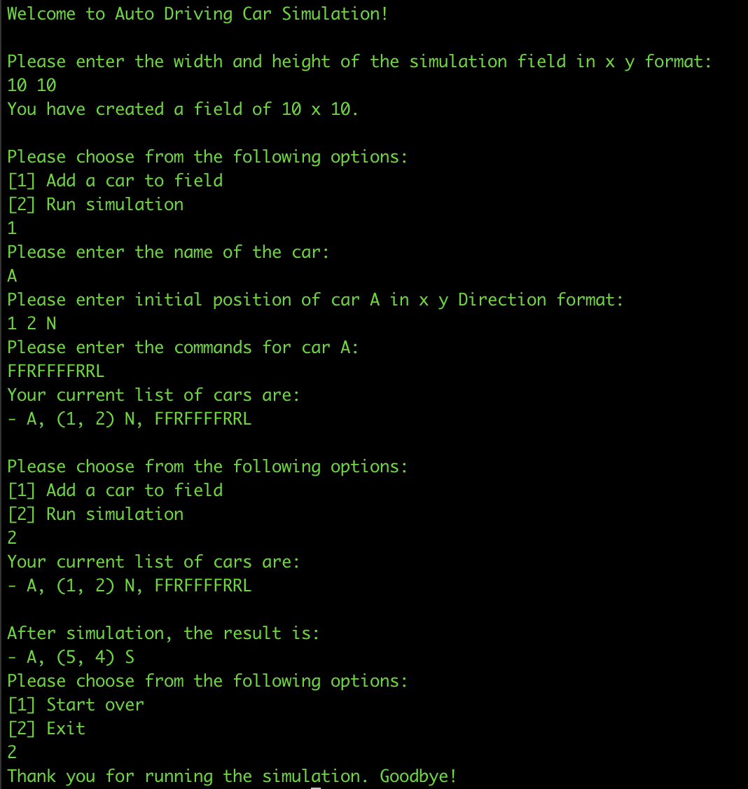
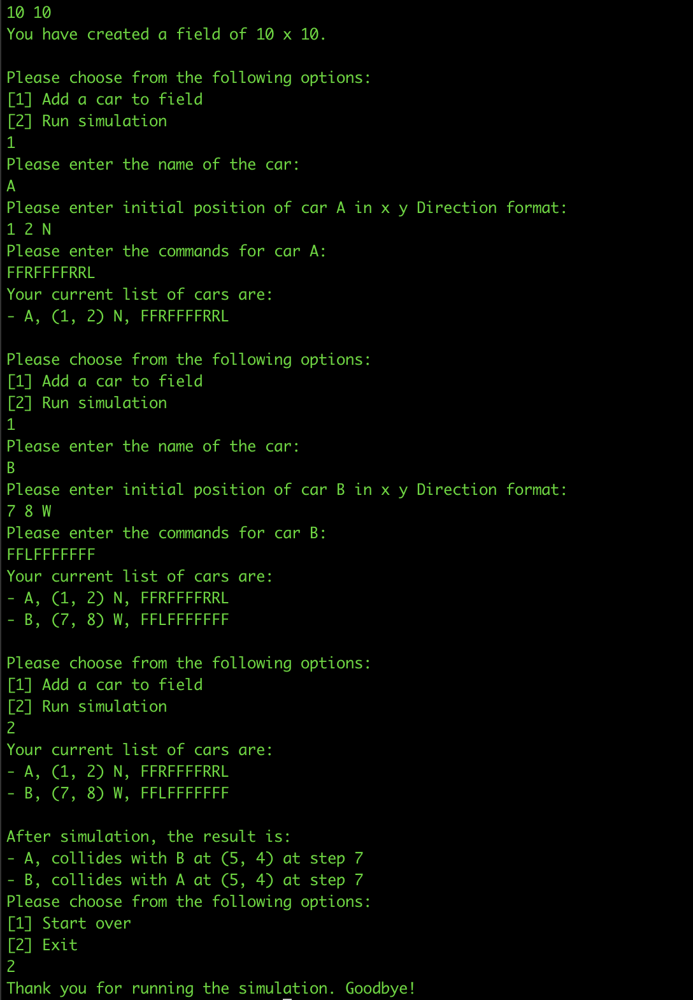

# Auto Driving Car Simulation

## Design

### Major Components

In this implementation, there are four major components as described bellow.

#### Runner

- Runner is the entry point of the simulation, where we call the `Run` method at the Program.
- Runner is responsible for driving/ initiating the state machine and for the reading and writing user input (from the
  console) and resulting prompt for each state (to the console).
- When the state machine reaches to the terminal state, the runner will stop the process and exit the process.

#### Field

- Field is the place where we encapsulate the details about the cars and the field
- Field contains the list of cars, its dimensions as well as the cars being collided.
- The simulator will initialize the Field and encapsulated within it.

#### Simulator

- Simulator is the outer-most abstraction of the simulation for the State machine.
- State machine's context has an instance of the `Simulator`, which will be available for the states.
- States will access various details related to the Simulation, via the `Simulator`.
- Simulator allows the states to perform modifications to the simulation characteristics via the provided utilities. For
  example, adding cars.

### Handling the 360 orientation

- Orientation/ Direction is handled via the `Direction` enum
- 360 turn is handled by keeping and updating an index.
- Refer to `CarTest.cs` for the handled use-cases

### Handling the cars being crashed to the boundaries

- Cars have access to the dimensions and before moving forward, the cars check its displacement. If the displacement is
  beyond the boundaries, the car will stay at the same position.

### Handling the cars with different number of commands

- The `Field` implementation is responsible for moving the cars.
- Field is running through a loop, until it finds out that there are no remaining moveable cars
- Field will decide the moving state of a car if the car's `Moving` flag is false
- Car's `Moving` state will be changed if its commands have been ran out or, if the car has been collided. The latter
  will be decided by the field since the car is driven by the simulation and field has the knowledge on other cars.
- Running out of commands will be keeping track by the car it self and decide whether to stop
- Refer to `FieldTests` for the use-cases
#### State Machine

- State machine implementation is used to drive the execution of the simulation.
- State machine is implemented using the `State Design Pattern`.
- Each state has two APIs
    - **Prompt**: Prompt the output to the user
    - **Process**: Process the user input
- Following are the list of states in the system
    - **InitialState**: *Handles Welcome message and capture dimensions*
    - **AddCarState**: *Handles adding a car to the simulation, step by step. These steps have been handled internally
      in the __AddCarState__ itself*
    - **RunSimulationState**: Responsible for running the simulation
    - **RestartOrExitState**: Handles the state of allowing the user to choose whether to start over or Exit the
      simulation
    - **TerminalState**: This is the indication for the runner to stop the simulation. When the state machine reaches
      this point, runner will stop the simulation

## How to run the project

Execute the following commands from the solution's directory

### Build the project

Execute `dotnet build`

### Run Tests

Execute `dotnet test`

### Run the Solution

Execute `dotnet run --project <path/to/AutoDrivingCar.csproj>`

## Example run

**Single car running**

**Running two cars with Collisions**

